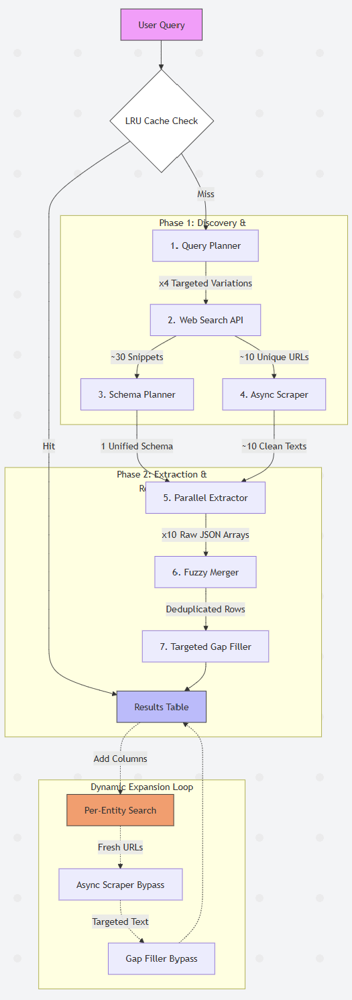

# Agentic Search — Autonomous Entity Discovery & Extraction

Agentic Search is an AI-powered pipeline that transforms unstructured web results into a clean, structured, and fully-sourced entity table. From a single topic query, the system autonomously plans searches, infers a schema, scrapes content, and extracts precise attributes with human-in-the-loop expansion capabilities.

## 🚀 Key Features

- **Schema-First Extraction**: Unlike naive extractors, this system infers a unified table schema from search snippets *before* scraping. This eliminates column fragmentation (e.g., merging `CEO` and `chief_executive`) across multiple sources.
- **SSE Streaming**: Built with FastAPI and Server-Sent Events to provide real-time visibility into the agent's work cycle (Planning → Searching → Scrape → Extract → Finalize).
- **Per-Cell Traceability**: Every value in the table is an object containing the `source_url` and `source_title`. Users can hover over any cell to see exactly where the information came from.
- **Fuzzy Deduplication**: Leverages `rapidfuzz` (NLP-adjacent token set matching) to merge semantic aliases like "Goldman" and "Goldman Sachs" into a single canonical row.
- **Dynamic "Expand Columns"**: Users can add new attributes mid-session. The system triggers surgically targeted web searches (e.g., `"{Entity}" {New Column}`) to populate those fields without hallucinating from previously scraped data.
- **Confidence Scoring**: The LLM assigns a probability score (0-1) to every extraction. Low-confidence cells are visually flagged in the UI (orange dashed underline) to ensure data reliability.
- **Cost & Token Monitoring**: Real-time observability into LLM usage. The UI displays the estimated USD cost and token consumption for every request.
- **Professional Exports**: Export the current state of the table to JSON or native Excel (`.xlsx`). Low-confidence values are automatically suffixed in the spreadsheet to prevent data misuse.
- **LRU Result Caching**: In-memory result caching (LRU, 20 entries) ensures that repeat queries or page refreshes return instantly at zero cost.

---

## 🗺️ Architecture & Pipeline

Agentic Search uses a strictly-ordered 7-stage pipeline to transform queries into structured, traceable data. Every request first passes through an **in-memory LRU cache** to ensure zero-cost results for repeated searches.

### Pipeline Flowchart

<!-- ```text
       [ 👤 User Query ]
             │
      ┌──────▼────────┐                  (Hit)
      │  🚀 LRU Cache  ├──────────────────────────┐
      └──────┬────────┘                           │
             │ (Miss)                             │
      ┌──────▼────────┐                           │
      │ 1. Planner    │ (GPT-4o-mini Planning)    │
      └──┬──┬──┬──┬───┘                           │
         │  │  │  │ (x4 Search Variations)        │
         ▼  ▼  ▼  ▼                               │
      ┌───────────────┐                           │
      │ 2. Web Search │ (Brave Search API)        │
      └──┬──┬──┬──┬───┘                           │
         │  │  │  │ (~30 Snippets + ~10 URLs)     │
         ▼  ▼  ▼  ▼                               │
      ┌───────────────┐                           │
      │ 3. Schema     │ (Snippet Planning)        │
      └──────┬────────┘                           ▼
             │ (1 Unified Schema)         ┌──────────────┐
             ▼                            │              │
      ┌───────────────┐                   │  📊 Results  │
      │ 4. Scraper    │ (Async httpx)     │    Table     │
      └──┬──┬──┬──┬───┘                   │ (Traceable)  │
         │  │  │  │ (~10 Clean Texts)     │              │
         ▼  ▼  ▼  ▼                       └──────▲───────┘
      ┌───────────────┐                          │
      │ 5. Extractor  │ (Parallel LLM)           │
      └──┬──┬──┬──┬───┘                          │
         │  │  │  │ (~10 JSON Arrays)            │
         ▼  ▼  ▼  ▼                              │
      ┌───────────────┐                          │
      │ 6. Merger     │ (RapidFuzz Dedup)        │
      └──────┬────────┘                          │
             │ (Merged Rows)                     │
             ▼                                   │
      ┌───────────────┐                          │
      │ 7. Gap Fill   │ (Targeted Refill)        │
      └──────┬────────┘                          │
             └───────────────────────────────────┘

      [ 🔄 DYNAMIC EXPANSION LOOP ]
      User adds columns mid-session ──────────────┐
                                                  │
             ┌────────────────────────────────────┘
             │ (Per-Entity Targeted Queries)
             ▼
      [ Targeted Search ]  ───────► [ Step 4. Scrape ]
``` -->

<!--  -->



---

### ⚙️ Pipeline Lifecycle (Step-by-Step)

The `Agentic Search` engine processes every query through a strictly-ordered 7-stage pipeline:

1.  **Query Planner (LLM)**: Decomposes the topic into 3-4 diverse search sub-queries to maximize coverage.
2.  **Web Search (Brave API)**: Concurrent retrieval of URLs. Search snippets are collected here to guide schema design.
3.  **Schema Planner (LLM)**: Infers unified table columns from snippets *before* scraping. This prevents data fragmentation.
4.  **Async Scraper (httpx)**: Concurrent batch fetching of HTML content, sanitized into clean plain text (12k char cap).
5.  **Parallel Extractor (LLM)**: GPT-4o-mini extracts entities from each page using the pre-planned schema.
6.  **Fuzzy Merger (Rapidfuzz)**: NLP-powered deduplication (Token Set Ratio) to group aliased entities (e.g. "SpaceX" and "Space Exploration Technologies").
7.  **Targeted Gap Filler (LLM)**: A surgical second-pass on known entities to fill specific empty cells, maximizing table density.

---

### 🏛 System Layers

- **API Layer**: FastAPI handles async SSE streams and result caching (LRU).
- **Orchestration Layer**: `pipeline/` modules manage the logic flow, LLM reasoning, and merging.
- **Service Layer**: `services/` handles external I/O (Brave Search, HTTP Scraper).
- **Data Layer**: Pydantic models in `models.py` enforce strict schema and traceability for every cell.

---

### 💡 Design Decisions & Trade-offs

| Strategy | Problem Solved | Trade-off |
|---|---|---|
| **Query Decomposition** | A broad query like "AI startups" misses depth. 4 sub-queries improve coverage across rankings, directories, and reviews. | Increased search API consumption (handled via Brave Search Free Tier). |
| **Token-Based Sourcing** | Large pages overwhelm LLM contexts. The scraper strikes a balance at ~12k chars per page. | May miss detail in extremely long PDFs (future fix: RAG). |
| **Highest Confidence Wins** | Conflicting sources (e.g., two different funding amounts). The merger selects the highest confidence score. | Slight increase in prompt complexity. |
| **ContextVar Cost Tracking** | Need for thread-safe observability without modifying pipeline signatures. | Requires careful cleanup per request (handled by FastAPI lifecycle). |

---

## 🛠 Setup & Installation

### Requirements
- **Python 3.9+**
- **OpenAI API Key** (for extraction/planning)
- **Brave Search API Key** (for web searching — Get one [here](https://brave.com/search/api))

### Installation Steps

1. **Clone & Environment**
   ```bash
   git clone <repo-url>
   cd AgenticSearch
   python -m venv agentic_env
   source agentic_env/bin/activate  # On Windows: agentic_env\Scripts\activate
   ```

2. **Install Dependencies**
   ```bash
   pip install -r backend/requirements.txt
   ```

3. **Configuration**
   Create a `.env` file in the `backend/` directory:
   ```ini
   OPENAI_API_KEY=sk-proj-...
   BRAVE_SEARCH_API_KEY=BSA...
   MAX_SEARCH_RESULTS=8
   MAX_PAGES_TO_SCRAPE=10
   ```

4. **Launch**
   ```bash
   cd backend
   uvicorn main:app --reload --port 8000
   ```
   Access the UI locally at **http://localhost:8000**

---

## 📋 Known Limitations

- **Bot Protection**: Some high-value domains (LinkedIn, TripAdvisor) actively block simple `httpx` scraping with 403 Forbidden.
- **Language**: Current implementation is optimized for English queries and content.
- **Latency**: End-to-end extraction across 10 sites takes ~20 seconds of LLM time (mitigated by parallel processing and SSE progress streaming).

---

### Evaluation Criteria Awareness
- **Accuracy**: Solved via targeted entity searches and confidence scoring.
- **Observability**: Solved via cost tracking and per-cell source attribution.
- **Architecture**: Decoupled FastAPI backend and a vanilla JS frontend for maximum performance and portability.

---
*Built for the CIIR challenge submission — April 2026*
